See [Document](https://macacagames.github.io/MacacaViewSystem/) for more detail.


# Overview
**ViewSystem** is a element based UI management system based on Unity GUI. It is developed and used by Macaca Games.
UI management in Unity3D is always a hard work, the goal of **ViewSystem** is to make UI management more easier and flexable.

## Feature
- Element based UI manager system
- UI Element pooling system
- Property and Event override in runtime
- Node based editor
  
# Concept
## ViewElement
ViewElement is the base unit in ViewSystem, any item shows on an UI page can be a ViewElement, such as a button, a icon or anything else.

For example, the red square part in the screenshot is a ViewElement.


And the most important thing, ViewElement only focus how it will show or leave and **doesn't** care where it will be placed.

Currently there is four method to transition while we try to showing or leaving a ViewElement: **Animator**, **CanvasGroup Fade**, **Active Switch**, **Custom**.

## ViewPage
ViewPage compose with one or more ViewElements and define where the ViewElements should be placed. Base on it's default behaviour there is two kind of ViewPage : FullPage, OverlayPage.

### FullPage
The basic type of ViewPage, the system only allow one FullPage shows on the screen at the same time.
When the ChangePage action is fire, system will leave all ViewElements defined in last FullPage and then show the ViewElements defined in next FullPage.

### OverlayPage
Sometimes we may wants an UI page shows and covered current screen, the OverlayPage can helps to implement the feature.

This is very useful when making Dialog, LoadingView ect.

OverlayPage allow to shows more than one page in the same time, each OverlayPage maintain it's own lifecycle.

> Currently, different OverlayPage can be show in the same time, but the same OverlayPage still has only one instance the duplicate call to shows an OverlayPage which is already on the screen is not allowed and the call will be ignore, but if you wish to replay the show animation in the ViewElement you can set the parameter **ReShowWhileSamePage** to True while calling the ShowOverlayPage API.

## ViewState
ViewState is similar as ViewPage, ViewState can define the duplicate part in two or more ViewPage.

Each ViewPage can setup at most one ViewState.

And also the ViewElements define in ViewState will not be update until the ViewState is changed.

## ViewController
ViewController is the core component of ViewSystem, all control of the UI is base on this component.

# Installation

### Option 1: Installation via OpenUPM (Recommend)

```sh
openupm add com.macacagames.viewsystem
```

## Option 2: Unity Package file
Add it to your editor's manifest.json file like this:
```json
{
    "dependencies": {
        "com.macacagames.utility": "https://github.com/MacacaGames/MacacaUtility.git",
        "com.macacagames.viewsystem": "https://github.com/MacacaGames/MacacaViewSystem.git"
    }
}
```

## Option 3: Git SubModule
```bash
git submodule add https://github.com/MacacaGames/MacacaViewSystem.git Assets/MacacaViewSystem
```
Note: ViewSystem is dependency with MacacaUtility, so also add MacacaUtility in git submodule.
```bash
git submodule add hhttps://github.com/MacacaGames/MacacaUtility.git Assets/MacacaUtility
```

# Setup
## 1. Editor
Menu Path : MacacaGames > ViewSystem > Visual Editor

ViewSystem will create required data and save under Assets/ViewSystemResources folder.

## 2. Create ViewController
In the Scene which you wish to add UI, create a new GameObject and attach ViewControll Component, then drag ViewSystemData to component.
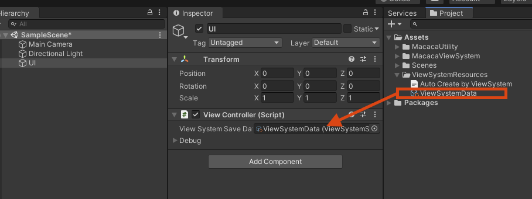

## 3. Create UGUI Canvas
Click ``GlobalSetting`` button on toolbar.

- Click the ``Generate default UI Root Object`` button to automatically generate your first UI root.
- Set ViewController gameObject name to ``View Controller GameObject`` field. (As the screenshot is ``UI``)
- Remember click ``Save`` button on toolbar after all step is done
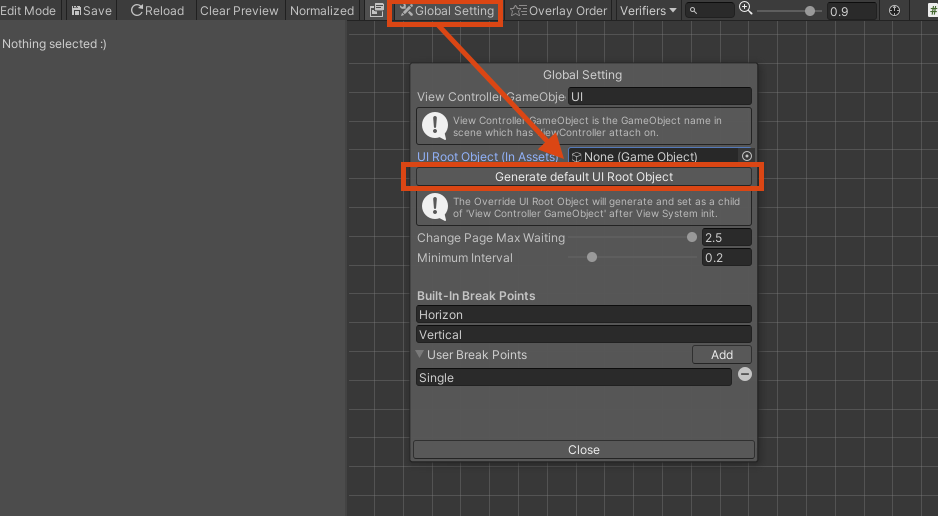

## 4. Ready to go!
Now, all setup step is done, use Example Project to learn how to edit your UI.

# Usage
Use the Visual Editor to edit your UI page.

Menu Path : MacacaGames > ViewSystem > Visual Editor
## Make a ViewPage
You can define the ViewElement and and its RectTransform info by Visual Editor.
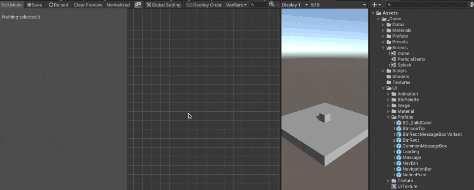

### Position a ViewElement on ViewPage

There are 2 different ways to define the position of a ViewElement on a ViewPage: RectTransform or CustomParent.
- RectTransform

On the Visual Editor, as the gif you can define the RectTransform information of a ViewElement just like modifing the RectTransform Component.
When you're previewing a ViewPage, all modify on the RectTransform information will automatically update to the previewing Screen.

- Custom Parent

Another way to position your ViewElement is using Custom Parent mode, in Custom Parent mode the system will find the Transform object which you define and set to that Object's child.

The Custom Parent mode is despreded, we only recommend using this mode in special situation such as you would like to put a ViewElement as another ViewElement's child in the runtime.


## Override property on a ViewElement
You can override any property on ViewElement, use preview to take effect the override.
With the override system, you can simply create the ViewElement variant in different ViewPage.
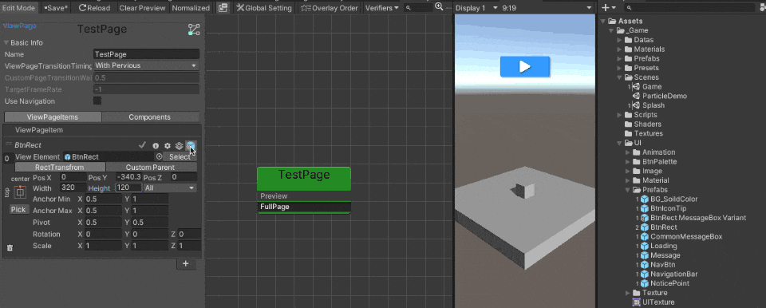

### Why using ViewSystem's override but not Unity Prefab variant?
ViewSystem override is a runtime function, it means all modify only exsit during the Game is runing, use the ViewSystem override helps you to avoid to make a lot of Prefab variant assets.

Limitation, the ViewSystem override has no ability to add/remove Component, GameObject etc. In this case use Unity Prefab variant.

## Override UnityEvent on a ViewElement
The override system also support to bind UnityEvent on an UGUI selectable.

Make a method with Component parameter and attact ``ViewSystemEvent`` attribute on it, the method will show on up the override window.


Example: (In UIManager.cs)
```csharp
[MacacaGames.ViewSystem.ViewSystemEvent]
public void MyEvent(Component selectable)
{
    //Do something
}
```

## Override Property or Button.onClick on a ViewElement via script
You can override a property via Attribute in a script, take this example, this means override the `sprite` property on `UnityEngine.UI.Image` component on a child GameObject which name is `Frame` by the value of `someSprite` variable.

```csharp
[OverrideProperty("Frame", typeof(UnityEngine.UI.Image), nameof(UnityEngine.UI.Image.sprite)) ]
[SerializeField]
Sprite someSprite;


[OverrideButtonEvent("TopRect/Button")]
void Test(Component component)
{
    Debug.Log("success");
}
```

## Safe Area
ViewSystem support Safe Area adjustment on the screen.
Each can setup its owned Safe Area setting, or using the Safe Area global setting, the Safe Area support is modified from [5argon/NotchSolution](https://github.com/5argon/NotchSolution) and with deep intergation with ViewSystem, thanks for his/her great works!


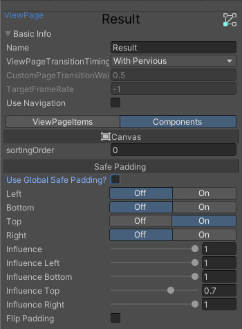
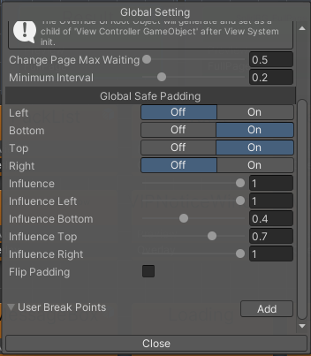

## Page Ordering

Since the ViewSystem allow have more than one `Overlay ViewPage` in the same time, the `Overlay ViewPage` may covering eachother, therefore you need to maintain ording of the `Overlay ViewPage`s your self, to do so using the `Overlay order` tools to helps your complete the works.

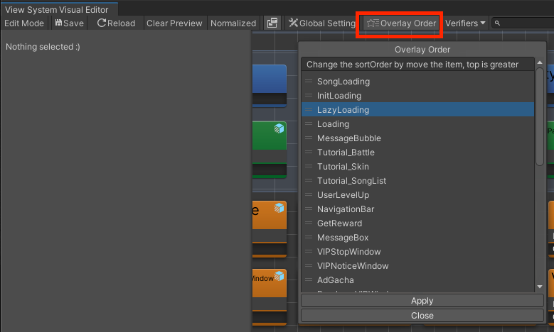

# Components

## ViewElementGroup
Something we me may wish to use already exsited ViewElement inside another ViewElement, in this way the ViewElementGroup can helps.
ViewElementGroup works a little like CanvasGroup, if the ViewElement has ViewElementGroup attached,the OnShow/OnLeave intent will also send into the children ViewElement, therefore the whole ViewElement will show/leave correctlly.

As the attach screenshot, the ConfirmBox is a ViewElement and BtnNegitive, BtnPositive is children ViewElement.
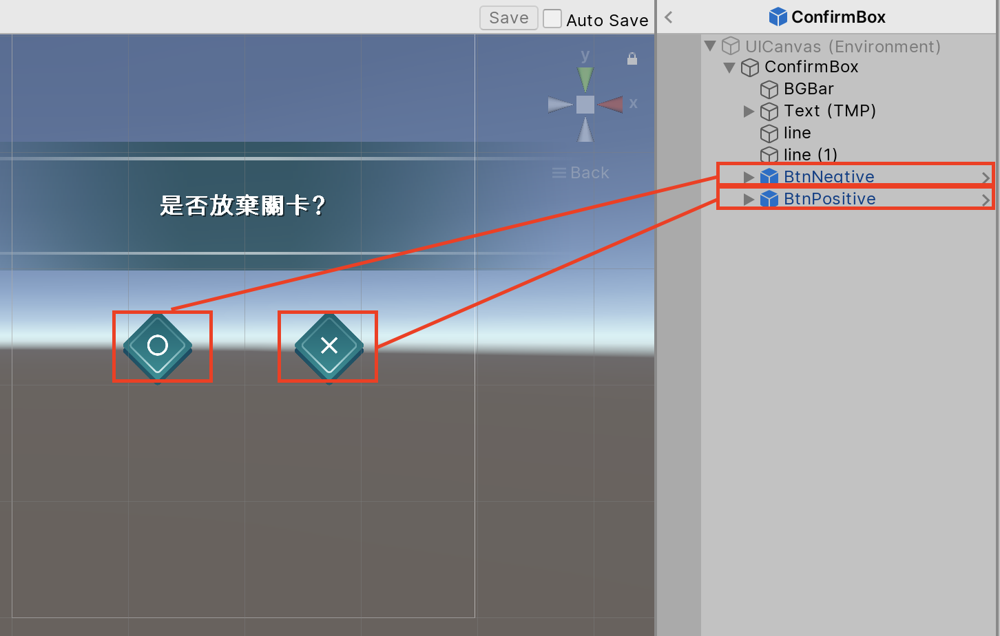

There is a **Only Manual Mode** switch on ViewElementGroup, if the swich on, ViewElement will ignore the OnShow/OnLeave intent send by ViewController.
It is helpful while we wish to control the ViewElement show/leave via script.
```csharp
[SerializeField]
ViewElement someViewelement;

// Set the parameter to true to manual show the ViewElement which ViewElementGroup's **Only Manual Mode** is on.
someViewelement.OnShow(true);

// If the ViewElement is child of other ViewElement set the first bool to false to aviod the ViewElement to be pooled while OnLeave.
someViewelement.OnLeave(false, true);
```
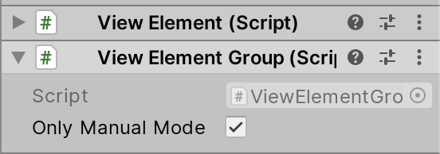

## ViewMarginFixer (Deprecated, only using in Custom Parent Mode)
ViewElement manage by the ViewSystem will be pooled if is not in use, that means the RectTransfrom's anchor stretch value may be wrong while it is taken out from pool. (cause by the Transfrom.SetParent(true);)

ViewMarginFixer is a helper to solve this issue, which override the anchor stretch value base on the ViewElement life cycle.


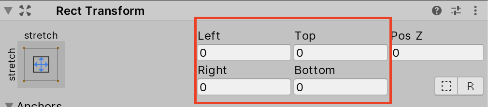

# LifeCycle Hook and Injection

## IViewElementLifeCycle
We can hooks the lifecycle on ViewElement by **IViewElementLifeCycle** interface, implemented the interface to get lifecycle callback on ViewElement.
```csharp
void OnBeforeShow();
void OnBeforeLeave();
void OnStartShow();
void OnStartLeave();
void OnChangePage(bool show);
```
System provide a component has implemented IViewElementLifeCycle which is called ViewElementLifeCycle.

It is useful if we wish to setup callback via inspector with UnityEvents, or inherit the component to overrid the method.

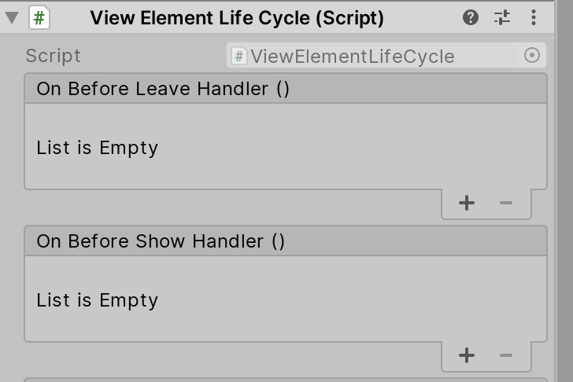

```csharp
public class SomeClass : ViewElementLifeCycle
{
    public override void OnBeforeShow()
    {
       // Do something
    }
}
```

> Note : Component implemented **IViewElementLifeCycle** needs to attach on ViewElement or its children.

## IViewElementInjectable
System provide a way to get global ViewElement reference from ViewController, component which inherit **IViewElementInjectable** interface will be created as singleton instance, that means the ViewElement will only one instance hole lifecycle.

```csharp
public class SomeInjectableClass : MonoBehaviour, IViewElementInjectable
{}

// Use GetInjectionInstance method on ViewController to get the singleton instance of ViewElement.
SomeInjectableClass someInjectableClass = ViewController.Instance.GetInjectionInstance<SomeInjectableClass>();
```

> Note : The ViewElement also needs to swtich the **IsUnique** boolean on to makes IViewElementInjectable works.


# System LifeCycle
## ViewController Initialization
> Here shows the Initialize proccess in ViewController. (Since V1 is dropped.)
1. Finding the UIRoot parent GameObject setup in GlobalSetting.
2. Instantiate UIRoot GameObject setup in GlobalSetting.
3. Generate ViewElementPool instance in scene.
3. Generate ViewElementRuntimePool instance in scene and initialize it.
4. Load ViewPage and ViewState data store in ViewSystemSaveData Object.
5. Pre-generate the ViewElement which has component inherited IViewElementInjectable

## FullPage ChangePage
> Once the ChangePage API is call in ViewController, the event, callback, lifecycle hack excude order. (Same behaviour while using FullPageChanger)

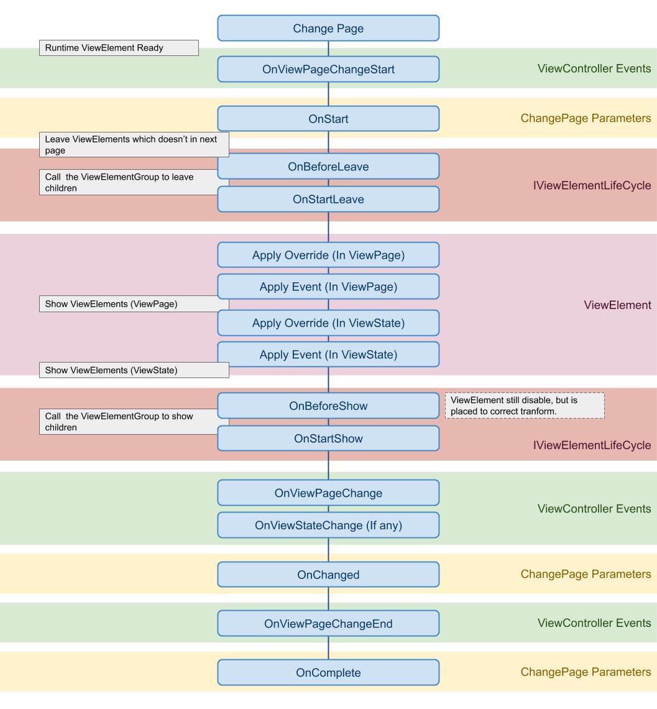

# How to...
## Get an runtime ViewElement reference in ViewPage/ViewState
If the target is an Unique ViewElement, you get it's instance via implement IViewElementInjectable on one of its component, then using ViewController.Instance.GetInjectionInstance<SomeInjectableClass>() API to get the instance. 
```csharp
// SomeInjectableClass is attach on target ViewElement
public class SomeInjectableClass : MonoBehaviour, IViewElementInjectable
{}

SomeInjectableClass someInjectableClass = ViewController.Instance.GetInjectionInstance<SomeInjectableClass>();
```

Otherwise GetViewPageElementByName or GetViewStateElementByName API to get the runtime instance in target ViewPage/ViewState.

Note:Since ViewElement is pooled and managed by ViewSystem, so those API only works while the target ViewPage/ViewState is live.
ViewElement reference may changed after each ChangePage() call is complete.
```csharp
public ViewElement GetViewPageElementByName(ViewPage viewPage, string viewPageItemName);

public ViewElement GetViewPageElementByName(string viewPageName, string viewPageItemName);

public T GetViewPageElementComponentByName<T>(string viewPageName, string viewPageItemName) where T : Component;

public ViewElement GetCurrentViewPageElementByName(string viewPageItemName);

public T GetCurrentViewPageElementComponentByName<T>(string viewPageItemName) where T : Component;

        //Get viewElement in statePage
public ViewElement GetViewStateElementByName(ViewState viewState, string viewStateItemName);
        
public T GetViewStateElementComponentByName<T>(ViewState viewState, string viewStateItemName) where T : Component;

public ViewElement GetViewStateElementByName(string viewStateName, string viewStateItemName);

public T GetViewStateElementComponentByName<T>(string viewStateName, string viewStateItemName) where T : Component;

public ViewElement GetCurrentViewStateElementByName(string viewStateItemName);

public T GetCurrentViewStateElementComponentByName<T>(string viewStateItemName) where T : Component;
```

