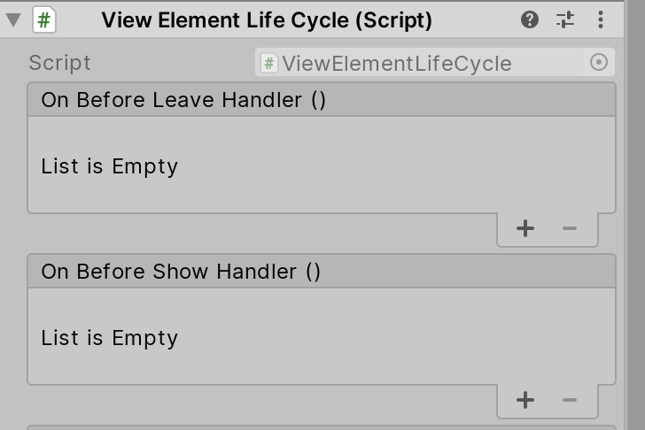

* [Overview](#overview)
* [Concept](#concept)
    + [ViewElement](#viewelement)
    + [ViewPage](#viewpage)
        + [FullPage](#fullpage)
        + [OverlayPage](#overlaypage)
    + [ViewState](#viewstate)
    + [ViewController](#viewcontroller)
* [Installation](#installation)
    + [Option 1: Git SubModule](#option-1-git-submodule)
    + [Option 2: Unity Package file](#option-2-unity-package-file)
    + [Option 3: Unity Package manager](#option-3-unity-package-manager)
* [Components](#components)
    + [ViewMarginFixer](#viewmarginfixer)
    + [ViewElementGroup](#viewelementgroup)
* [LifeCycle Hook and Injection](#lifecycle-hook-and-injection)
    + [IViewElementLifeCycle](#iviewelementlifecycle)
    + [IViewElementInjectable](#iviewelementinjectable)
* [System LifeCycle](#system-lifecycle)
    + [ViewController Initialization](#viewcontroller-initialization)
    + [FullPage ChangePage](#fullpage-changepage)
    + [OverlayPage Show](#overlaypage-show)
    + [OverlayPage Leave](#overlaypage-leave)


# Overview
**ViewSystem** is a SoC UI management system based on Unity GUI. It is developed and used by Macaca Games.
UI management in Unity3D is always a hard work, the goal of **ViewSystem** is to make UI management more easier and flexable.

# Concept
## ViewElement
ViewElement is the basic unit in ViewSystem, any item shows on an UI page can be a ViewElement, such as a button, a icon or anything else.

For example, the red square part in the screenshot is a ViewElement.


And the most important thing, ViewElement only focus how it will show or leave and **doesn't** care where it will be placed.

Currently there is four method to transition while we try to showing or leaving a ViewElement: **Animator**, **CanvasGroup Fade**, **Active Switch**, **Custom**.

## ViewPage
ViewPage compose with one or more ViewElements and define where the ViewElements should be placed. Base on it's default behaviour there is two kind of ViewPage : FullPage, OverlayPage.

### FullPage
The basic type of ViewPage, the system only allow one FullPage shows on the screen at the same time.
When the ChangePage action is fire, system will leave all ViewElements defined in last FullPage and then show the ViewElements defined in next FullPage.

### OverlayPage
Sometimes we may wants an UI page shows and covered current screen, the OverlayPage can helps to implement the feature.

This is very useful when making Dialog, LoadingView ect.

OverlayPage allow to shows more than one page in the same time, each OverlayPage maintain it's own lifecycle.

> Currently, different OverlayPage can be show in the same time, but the same OverlayPage still has only one instance the duplicate call to shows an OverlayPage which is already on the screen is not allowed and the call will be ignore, but if you wish to replay the show animation in the ViewElement you can set the parameter **ReShowWhileSamePage** to True while calling the ShowOverlayPage API.

## ViewState
ViewState is similar as ViewPage, ViewState can define the duplicate part in two or more ViewPage.

Each ViewPage can setup at most one ViewState.

And also the ViewElements define in ViewState will not be update until the ViewState is changed.

## ViewController
> Currently, since the V1 branch has been Archived the ViewController in /master branch is obsolete, use ViewController instead.

ViewController is the core component of ViewSystem, all control of the UI is base on this component.

# Installation
## Option 1: Git SubModule
```bash
git submodule add https://github.com/MacacaGames/MacacaViewSystem.git Assets/MacacaViewSystem
```
Note: ViewSystem is dependency with MacacaUtility, so also add MacacaUtility in git submodule.
```bash
git submodule add hhttps://github.com/MacacaGames/MacacaUtility.git Assets/MacacaUtility
```
## Option 2: Unity Package file
> Work in progress

## Option 3: Unity Package manager
> Work in progress

# Components
## ViewMarginFixer
ViewElement manage by the ViewSystem will be pooled if is not in use, that means the RectTransfrom's anchor stretch value may be wrong while it is taken out from pool. (cause by the Transfrom.SetParent(true);)

ViewMarginFixer is a helper to solve this issue, which override the anchor stretch value base on the ViewElement life cycle.


## ViewElementGroup
Something we me may wish to use already exsited ViewElement inside another ViewElement, in this way the ViewElementGroup can helps.
ViewElementGroup works a little like CanvasGroup, if the ViewElement has ViewElementGroup attached,the OnShow/OnLeave intent will also send into the children ViewElement, therefore the whole ViewElement will show/leave correctlly.

As the attach screenshot, the ConfirmBox is a ViewElement and BtnNegitive, BtnPositive is children ViewElement.


There is a **Only Manual Mode** switch on ViewElementGroup, if the swich on, ViewElement will ignore the OnShow/OnLeave intent send by ViewController.
It is helpful while we wish to control the ViewElement show/leave via script.
```csharp
[SerializeField]
ViewElement someViewelement;

// Set the parameter to true to manual show the ViewElement which ViewElementGroup's **Only Manual Mode** is on.
someViewelement.OnShow(true);

// If the ViewElement is child of other ViewElement set the first bool to false to aviod the ViewElement to be pooled while OnLeave.
someViewelement.OnLeave(false, true);
```


# LifeCycle Hook and Injection

## IViewElementLifeCycle
We can hooks the lifecycle on ViewElement by **IViewElementLifeCycle** interface, implemented the interface to get lifecycle callback on ViewElement.
```csharp
void OnBeforeShow();
void OnBeforeLeave();
void OnStartShow();
void OnStartLeave();
void OnChangePage(bool show);
```
System provide a component has implemented IViewElementLifeCycle which is called ViewElementLifeCycle.

It is useful if we wish to setup callback via inspector with UnityEvents, or inherit the component to overrid the method.



```csharp
public class SomeClass : ViewElementLifeCycle
{
    public override void OnBeforeShow()
    {
       // Do something
    }
}
```

> Note : Component implemented **IViewElementLifeCycle** needs to attach on ViewElement or its children.

## IViewElementInjectable
System provide a way to get global ViewElement reference from ViewController, component which inherit **IViewElementInjectable** interface will be created as singleton instance, that means the ViewElement will only one instance hole lifecycle.

```csharp
public class SomeInjectableClass : MonoBehaviour, IViewElementInjectable
{}

// Use GetInjectionInstance method on ViewController to get the singleton instance of ViewElement.
SomeInjectableClass someInjectableClass = ViewController.Instance.GetInjectionInstance<SomeInjectableClass>();
```

> Note : The ViewElement also needs to swtich the **IsUnique** boolean on to makes IViewElementInjectable works.


# System LifeCycle
## ViewController Initialization
> Here shows the Initialize proccess in ViewController. (Since V1 is dropped.)
1. Finding the UIRoot parent GameObject setup in GlobalSetting.
2. Instantiate UIRoot GameObject setup in GlobalSetting.
3. Generate ViewElementPool instance in scene.
3. Generate ViewElementRuntimePool instance in scene and initialize it.
4. Load ViewPage and ViewState data store in ViewSystemSaveData Object.
5. Pre-generate the ViewElement which has component inherited IViewElementInjectable

## FullPage ChangePage
> Once the ChangePage API is call in ViewController, the event, callback, lifecycle hack excude order. (Same behaviour while using FullPageChanger)

