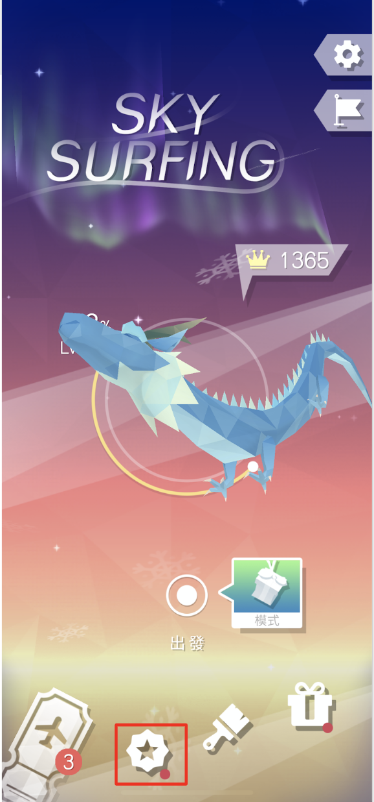

## Use case

## Introduction
**ViewSystem** is a element based UI management system based on Unity GUI. It is developed and used by Macaca Games.
UI management in Unity3D is always a hard work, the goal of **ViewSystem** is to make UI management more easier and flexable.

### Feature
- Element based UI manager system
- UI Element pooling system
- Property and Event override in runtime
- Node based editor
  
## How It Works
### ViewElement
ViewElement is the base unit in ViewSystem, any item shows on an UI page can be a ViewElement, such as a button, a icon or anything else.

For example, the red square part in the screenshot is a ViewElement. 

And the most important thing, ViewElement only focus how it will show or leave and **doesn't** care where it will be placed.

Currently, there are 5 methods to show or leave a ViewElement: `Animator`, `Canvas Group Alpha`, `Active Switch`, `ViewElement Animation`, `Custom`. For more details, check [ViewElement Transition](/docs/Fundamentals.md#viewelement-trasition).

### ViewPage
ViewPage compose with one or more ViewElements and define where the ViewElements should be placed. Base on it's default behaviour there is two kind of ViewPage : FullPage, OverlayPage.

- FullPage

The basic type of ViewPage, the system only allow one FullPage shows on the screen at the same time.
When the ChangePage action is fire, system will leave all ViewElements defined in last FullPage and then show the ViewElements defined in next FullPage.

- OverlayPage

Sometimes we may wants an UI page shows and covered current screen, the OverlayPage can helps to implement the feature.
This is very useful when making Dialog, LoadingView ect.

OverlayPage allow to shows more than one page in the same time, each OverlayPage maintain it's own lifecycle.

> Currently, different OverlayPage can be show in the same time, but the same OverlayPage still has only one instance the duplicate call to shows an OverlayPage which is already on the screen is not allowed and the call will be ignore, but if you wish to replay the show animation in the ViewElement you can set the parameter **ReShowWhileSamePage** to True while calling the ShowOverlayPage API.

### ViewState
ViewState is similar as ViewPage, ViewState can define the duplicate part in two or more ViewPage.

Each ViewPage can setup at most one ViewState.

And also the ViewElements define in ViewState will not be update until the ViewState is changed.

### ViewController
ViewController is the core component of ViewSystem, all control of the UI is base on this component.

 

___

 

### To learn more about ViewSystem, check [Document](https://macacagames.github.io/MacacaViewSystemDocs/).

### [Script API](https://macacagames.github.io/MacacaViewSystem/api/MacacaGames.ViewSystem.html)
