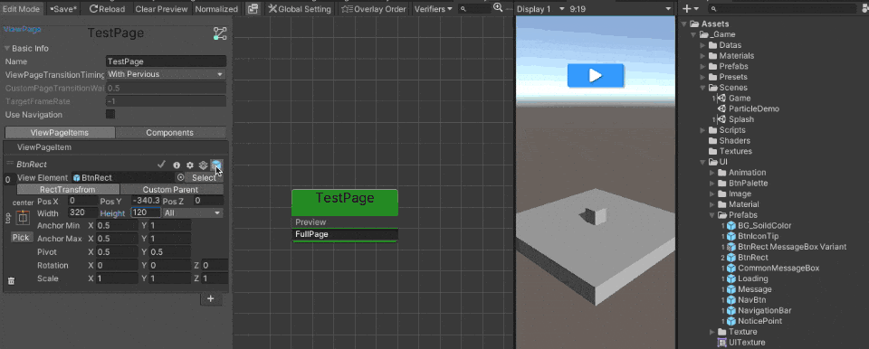

# ViewSystem

> **English** | [中文](./README_zh.md)

**ViewSystem** is an element-based UI management system for Unity, developed by [Macaca Games](https://github.com/MacacaGames).
It simplifies complex UI workflows with a visual node editor, element pooling, and runtime property/event overrides.

### Why ViewSystem?

UI development in Unity often suffers from tight coupling between layout, logic, and data — and the workflow tends to bottleneck on engineers. Designers hand off mockups, engineers rebuild them in Unity, and the gap between "design intent" and "implementation result" leads to endless back-and-forth over pixel-level details.

ViewSystem addresses this by **separating concerns across roles**:

- **ViewElement** defines *what* a UI element looks like and how it animates — **not** where it goes.
- **ViewPage** defines *where* elements are placed — configurable in the Visual Editor without code.
- **Runtime Override** lets designers tweak properties (text, color, sprites, layout) per page directly in the editor — no Prefab Variants, no code changes.
- **Model Injection** lets engineers focus purely on data flow and logic, while the visual configuration stays in the editor.

The result: **designers own the visual details, engineers own the behavior and data** — each working in their own domain with minimal handoff friction.

## Use Cases


## Features

- **Element-based architecture** — compose UI pages from reusable ViewElements
- **ViewElement pooling** — automatic pool management for optimal performance
- **Pool lifecycle policies & diagnostics** — KeepN/DestroyOnRecovery, object-graph dumps, and an evidence-based Policy Advisor
- **Runtime property & event overrides** — create ViewElement variants per page without prefab variants
- **Node-based visual editor** — design and preview UI pages directly in the editor
- **Fluent API** — chain page transitions with a clean, readable syntax
- **Lifecycle hooks & dependency injection** — `IViewElementLifeCycle`, `ViewElementBehaviour`, and `[ViewElementInject]`
- **Safe Area support** — per-page or global safe area configuration
- **Breakpoint system** — responsive ViewElement transforms based on named breakpoints

## Installation

**Option 1: OpenUPM (Recommended)**

```sh
openupm add com.macacagames.viewsystem
```

**Option 2: Unity Package Manager (Git URL)**

Add to your `Packages/manifest.json`:

```json
{
    "dependencies": {
        "com.macacagames.utility": "https://github.com/MacacaGames/MacacaUtility.git",
        "com.macacagames.viewsystem": "https://github.com/MacacaGames/MacacaViewSystem.git"
    }
}
```

**Option 3: Git Submodule**

```bash
git submodule add https://github.com/MacacaGames/MacacaViewSystem.git Assets/MacacaViewSystem
git submodule add https://github.com/MacacaGames/MacacaUtility.git Assets/MacacaUtility
```

## Core Concepts

### ViewElement

The base unit of ViewSystem. Any UI item on a page (button, icon, panel, etc.) can be a ViewElement.


A ViewElement defines **how** it appears and disappears, but **not where** it will be placed. There are 5 transition types:

| Transition | Description |
|---|---|
| **Animator** | Triggers Animator states (Show, Loop, Leave) |
| **Canvas Group Alpha** | Tweens CanvasGroup alpha for fade in/out |
| **Active Switch** | Toggles `GameObject.activeSelf` |
| **ViewElement Animation** | Built-in tween for transform (position, rotation, scale) and alpha |
| **Custom** | Fires a UnityEvent for full control |

### ViewPage

A ViewPage composes one or more ViewElements and defines **where** each should be placed. Two types:

- **FullPage** — Only one can be displayed at a time. Switching pages automatically leaves the current FullPage and shows the next.
- **OverlayPage** — Displays on top of the current screen. Multiple OverlayPages can coexist. Ideal for dialogs, loading screens, etc.

### ViewState

Defines shared ViewElement layouts across multiple ViewPages. Each ViewPage can reference at most one ViewState. ViewElements in a ViewState persist until the ViewState itself changes.

### ViewController

The core singleton that manages all page transitions and ViewElement lifecycle.

## Quick Start

### 1. Setup ViewController

Create a GameObject in your scene and attach the `ViewController` component. Assign your `ViewSystemData` asset.

### 2. Create UI Root

Open **MacacaGames > ViewSystem > Visual Editor**, click **Global Setting**, then **Generate default UI Root Object**.

### 3. Create a ViewElement

Create a UI object (Image, Button, etc.), attach the `ViewElement` component, and save as a prefab.

### 4. Create a ViewPage

In the Visual Editor, right-click > **Add FullPage**, then add your ViewElement to the page's `ViewPageItems`.

### 5. Show a Page

```csharp
public class GameStart : MonoBehaviour
{
    void Awake()
    {
        ViewController
            .FullPageChanger()
            .SetPage("TestPage")
            .Show();
    }
}
```

## Page Transition API

ViewSystem uses a **Fluent Interface** via `PageChanger`:

```csharp
// FullPage — auto-leaves previous page
ViewController
    .FullPageChanger()
    .SetPage("MyPage")
    .SetPageModel(someData, "hello")   // inject data into ViewElements
    .SetIgnoreClickProtection(false)    // enable click debounce (default 0.2s)
    .SetWaitPreviousPageFinish(true)    // queue transition instead of cancel
    .SetIgnoreTimeScale(true)           // ignore Time.timeScale
    .OnStart(() => Debug.Log("Start"))
    .OnComplete(() => Debug.Log("Done"))
    .Show();

// OverlayPage — must manually Show/Leave
ViewController
    .OverlayPageChanger()
    .SetPage("DialogPage")
    .Show();

// Leave an OverlayPage
ViewController
    .OverlayPageChanger()
    .SetPage("DialogPage")
    .Leave();
```

## Runtime Overrides

Override any property on a ViewElement per-page — no prefab variants needed:



### Via Visual Editor

Set property overrides directly in the ViewSystem Editor's Override Window.

### Via Script (Attribute)

```csharp
public class MyUILogic : ViewElementBehaviour
{
    [OverrideProperty("Frame", typeof(Image), nameof(Image.sprite))]
    [SerializeField]
    Sprite someSprite;

    [OverrideButtonEvent("TopRect/Button")]
    void OnButtonClick(Component component)
    {
        Debug.Log("Clicked!");
    }
}
```

### Via Script (ViewElementOverride)

```csharp
public class MyScript : MonoBehaviour
{
    [SerializeField]
    ViewElementOverride myOverride;

    void ApplyOverride()
    {
        GetComponent<ViewElement>().ApplyOverrides(myOverride);
    }
}
```

### Event Override

Declare methods with `[ViewSystemEvent]` to make them available in the Override Window:

```csharp
[ViewSystemEvent("MyGroup")]
public void OnConfirmClick(Component selectable)
{
    // Handle click
}
```

## Lifecycle Hooks & Injection

### IViewElementLifeCycle

Implement on any MonoBehaviour attached to a ViewElement:

```csharp
public class MyUI : MonoBehaviour, IViewElementLifeCycle
{
    public void OnBeforeShow() { }
    public void OnBeforeLeave() { }
    public void OnStartShow() { /* ViewElement is now visible */ }
    public void OnStartLeave() { }
    public void OnChangePage(bool show) { }
    public void OnChangedPage() { }
    public void RefreshView() { }
}
```

### ViewElementBehaviour

A convenience base class implementing `IViewElementLifeCycle` with UnityEvent inspector support:

```csharp
public class MyUI : ViewElementBehaviour
{
    public override void OnStartShow()
    {
        RefreshView();
    }
}
```

### Model Injection (`[ViewElementInject]`)

Send data to ViewElements when changing pages:

```csharp
public class MyUILogic : ViewElementBehaviour
{
    [ViewElementInject]
    int score;

    [ViewElementInject]
    string playerName { get; set; }
}

// Pass data via SetPageModel
ViewController.FullPageChanger()
    .SetPage("ResultPage")
    .SetPageModel(99999, "Player1")
    .Show();
```

Combine with override for one-liner data binding:

```csharp
[ViewElementInject]
[OverrideProperty("Text", typeof(TextMeshProUGUI), nameof(TextMeshProUGUI.text))]
string displayText;
```

For multiple values of the same type, use `ViewInjectDictionary<T>`:

```csharp
var data = new ViewInjectDictionary<string>();
data.TryAdd("title", "Hello");
data.TryAdd("subtitle", "World");

ViewController.FullPageChanger()
    .SetPage("MyPage")
    .SetPageModel(data)
    .Show();
```

### Shared Model

`IViewElementSingleton` instances automatically become **Shared Models**, available to all pages without `SetPageModel()`:

```csharp
public class CurrencyDisplay : ViewElementBehaviour, IViewElementSingleton { }

// Inject anywhere without SetPageModel
public class ShopUI : ViewElementBehaviour
{
    [ViewElementInject]
    CurrencyDisplay currency; // auto-injected
}
```

Control search scope with `InjectScope`:

```csharp
[ViewElementInject(InjectScope.SharedOnly)]
MyClass myData;
```

## Unique ViewElement

`Unique ViewElement` means there is exactly one runtime instance shared across pages.  
Use it for cross-page UI that should keep state and avoid duplicate instantiation.

### Design Intent

1. One instance, shared usage:
   Move the same element between pages instead of spawning page-local copies.
2. Predictable ownership:
   In multi-overlay scenarios, return targets should follow a clear rule, not accidental order.
3. Content-friendly workflow:
   Teams can treat it as reusable shared UI without duplicating prefabs per page.
4. Compatibility-first:
   Keep existing FullPage / Overlay / ViewState workflows without forcing architecture changes.
5. Safe recovery:
   If no active page still needs it, recover it to pool.

### Good Fit

1. A UI element is reused across multiple overlays and should keep state.
2. Initialization cost is high and repeated creation should be avoided.
3. The element is conceptually shared, not page-private.

### Not a Good Fit

1. Multiple pages need independent simultaneous instances.
2. State must never be shared across page boundaries.

### Behavior Summary (Current Implementation)

1. A Unique ViewElement has a single runtime instance.
2. On overlay leave, it first returns to the previous borrower (LIFO).
3. If that borrower is invalid, it falls back to active owners (other overlays -> full page -> view state).
4. If no active owner exists, it leaves and is recovered to pool.

### Presentation Behavior (Animation & Visuals)

1. When ownership is restored:
   The same instance is moved back to the target parent/transform (no destroy/recreate cycle).
2. When closing an overlay with a valid owner:
   It performs a return transition via `ChangePage(true, ...)`, reusing existing tween/position rules.
3. When closing an overlay with no valid owner:
   It runs leave flow via `ChangePage(false, ...)`, then recovers to pool.
4. If `useInstantPosition` is enabled:
   Repositioning snaps instantly; otherwise it follows configured interpolation behavior.
5. Overall goal:
   Keep a continuous visual performance with minimal flicker or "rebuilt" feeling.

### Example

1. FullPage A -> Overlay B -> Overlay C share one Unique ViewElement:
   - Close C: return to B.
   - Close B: return to A.
2. If no owner is active anymore:
   - Recover to pool instead of forcing it back to stale pages.

## Components

### ViewElementGroup

Propagates OnShow/OnLeave to child ViewElements (similar to CanvasGroup). Enable **Only Manual Mode** to control show/leave from script:

```csharp
[SerializeField] ViewElement child;

child.OnShow(true);              // manual show
child.OnLeave(false, true);      // manual leave without pooling
```

## Visual Editor

Open via **MacacaGames > ViewSystem > Visual Editor**.

| Tool | Description |
|---|---|
| **Edit Mode** | Preview ViewPages in edit time with a temporary scene |
| **Save** | Save all changes and exit Edit Mode |
| **Global Setting** | UI Root generation, Safe Area config, breakpoints, click protection interval |
| **Overlay Order** | Drag-and-drop sort order for overlay pages |
| **Bake to Script** | Generate C# constants for ViewPage/ViewState names |
| **Verifiers** | Check for missing GameObjects, overrides, events, and page references |

### Bake to Script

Generate type-safe page name constants:

```csharp
ViewController
    .OverlayPageChanger()
    .SetPage(ViewSystemScriptable.ViewPages.ConfirmDialog)
    .Show();
```

## Pool Lifecycle, Recovery Policies, and Diagnostics

By default, non-unique ViewElements are retained in the runtime pool forever. This minimizes repeated instantiation, but a large or infrequently used UI can retain a substantial inactive hierarchy after its first use.

### Recovery policy

Set the policy on the root `ViewElement` Inspector:

| Policy | Behavior after leave and recovery |
|---|---|
| `KeepForever` | Retain every recovered instance. This is the backward-compatible default. |
| `KeepN` | Retain at most `recoveryKeepCount` queued instances for that prefab. Active and pending-recovery instances are not included in the limit. |
| `DestroyOnRecovery` | Permanently destroy the recovered GameObject hierarchy instead of retaining it in the runtime pool. |

Recovery policies apply to non-unique ViewElements. Unique/singleton ownership is a separate contract and must not be converted to ordinary parent destruction without an ownership review.

You can also select prefab assets in the Project window and use:

`Assets > MacacaGames > ViewSystem > Recovery Policy`

This menu writes through Unity Editor APIs and is disabled in Play Mode. Review candidates individually; do not batch-convert a project to `DestroyOnRecovery` based only on hierarchy size.

### Permanent lifetime scope

Every runtime `ViewElement` exposes `Lifetime`. The scope is disposed only when that runtime hierarchy is permanently destroyed; ordinary recovery to the pool does not dispose it.

Use it for cancellation, cleanup ownership, and scope-bound subscriptions:

```csharp
[SerializeField] ViewElement ownerViewElement;
[SerializeField] ViewElement itemTemplate;

ViewElementRequestedPool itemPool;

void Awake()
{
    itemPool = ownerViewElement.Lifetime.CreatePool(
        itemTemplate,
        ViewElementChildRecoveryMode.DestroyWithOwner);

    ownerViewElement.Lifetime.Subscribe<Action>(
        handler => model.Changed += handler,
        handler => model.Changed -= handler,
        RefreshView);
}

async Task LoadAsync()
{
    var token = ownerViewElement.Lifetime.Token;
    await LoadContentAsync(token);
    if (token.IsCancellationRequested || !ownerViewElement.Lifetime.IsAlive)
        return;

    ApplyContent();
}
```

Owner-aware requested pools support three child recovery modes:

| Mode | Ownership behavior |
|---|---|
| `ReturnToGlobalPool` | Return owned children to the global runtime pool when the owner is disposed. |
| `DestroyWithOwner` | Keep recovered children owner-local and destroy their complete hierarchies with the owner. Templates containing unique ViewElements are rejected. |
| `UseChildPolicy` | Return children through the global runtime pool and honor each child's recovery policy. |

Prefer `ownerViewElement.Lifetime.CreatePool(...)` for pools owned by a runtime ViewElement. The legacy ownerless `new ViewElementRequestedPool(...)` and `GetPool(...)` APIs retain global ownership behavior.

### Dump the runtime object graph

Enter Play Mode, wait until `ViewController` is initialized, then run:

`MacacaGames > ViewSystem > Diagnostics > Dump Object Graph`

The JSON report is written to the host project's `MemoryLeakReports/` directory. It includes runtime roots, pool prefab GUID/path identity, active/queued/pending instances, hierarchy GameObject and MonoBehaviour counts, requested-pool ownership, nested unique elements, dry-run trimmable counts, and Addressable handle observations.

For a migration candidate, capture snapshots in this order:

1. stable baseline page;
2. target UI open;
3. returned stable page after recovery settles;
4. target UI reopened;
5. returned stable page again.

### Pool Policy Advisor

Open:

`MacacaGames > ViewSystem > Diagnostics > Pool Policy Advisor`

The Advisor analyzes only prefabs referenced by the selected `ViewSystemSaveDataBase`, including direct and Addressable SaveData variants. Its workflow is:

1. Click **Analyze** for static prefab and script evidence.
2. Click **Add Runtime** to import Object Graph snapshots in chronological order.
3. Inspect **Target policy**, **Migration status**, **Safety blockers**, and **Next action**.
4. Click **Export Results** to write an Advisor JSON report to `MemoryLeakReports/`.

Schema v5 intentionally separates policy suitability from migration safety:

- `targetPolicy` / `targetKeepCount`: the desired memory policy;
- `migrationStatus`: code migration, review, or runtime validation state;
- `safetyBlockers`: concrete event, async, static, requested-pool, or ownership concerns;
- `policyConfidence` / `safetyConfidence`: independent confidence scores;
- `nextAction`: the smallest recommended follow-up.

A safety blocker does not mean `KeepForever` is the desired target. Existing `KeepN` and `DestroyOnRecovery` settings are treated as intentional migrations and are never reverted by static analysis alone. Advisor output remains dry-run evidence and does not automatically modify prefabs.

For agent-assisted migration, use the package-local [ViewSystem Pool Migration skill](.agents/skills/viewsystem-pool-migration/SKILL.md) with the exported Advisor report. The skill guides an agent through one candidate at a time: inspect event/async/ownership code, implement lifetime fixes, compile, apply the policy through Unity, and validate open/return/reopen behavior.

See [Pool Policy Design](VIEW_ELEMENT_POOL_POLICY_DESIGN.md) and [Migration Case Study](VIEW_ELEMENT_POOL_POLICY_CASE_STUDY.md) for the architecture and known failure modes.

## Troubleshooting

| Issue | Solution |
|---|---|
| `GameObject.activeSelf` not applied on ViewElement | Avoid setting `activeSelf` in `OnBeforeShow()` — the ViewElement isn't ready yet and ViewSystem may override it |
| Untitled scene in Hierarchy | Caused by entering Play Mode during Edit Mode. Delete it manually |
| Can't drag prefab into editor | Ensure the prefab has a `ViewElement` component |
| Lifecycle events not triggered | Ensure `ViewElement` component exists. For child objects, add `ViewElementGroup` to the parent |
| Editor shows nothing after update | Click **Normalized** in the toolbar to migrate save data |

## Links

- [Full Documentation](https://macacagames.github.io/MacacaViewSystemDocs/)
- [Source Code](https://github.com/MacacaGames/MacacaViewSystem)
- [Demo Project](https://github.com/MacacaGames/ViewSystemExample)
- [Script API Reference](https://macacagames.github.io/MacacaViewSystem/api/MacacaGames.ViewSystem.html)
